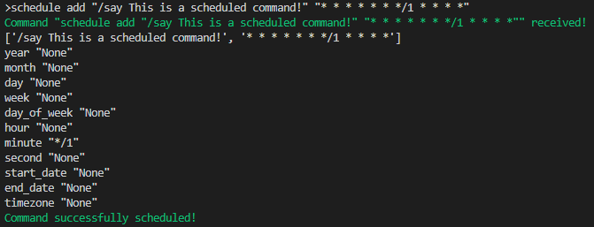
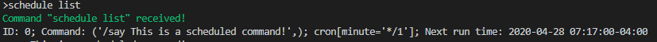
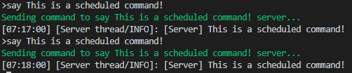
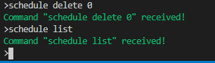

# How to Schedule like Cron

If you're reading this, you want to know how to schedule commands in a Cron like manner. If you don't know what Cron is I suggest you look through the following.

https://www.ostechnix.com/a-beginners-guide-to-cron-jobs/

And how it's used in APScheduler

https://apscheduler.readthedocs.io/en/stable/modules/triggers/cron.html

Ok let's get started. First you want to have some command to schedule. Let's say we want to run the following say command **(QUOTATIONS REQUIRED)**.

`"/say This is a scheduled command!"`

Great. Now, let's say we want it running every minute. Our second argument would be the following **(AGAIN, QUOTATIONS REQUIRED)**:

`"* * * * * * */1 * * * *"`

Now to pick this apart, let's reference the APScheduler documentation on cron above. The first start represents the year. When we place a star character, it fires on every year. The same applies for the month, day, and so on. But of course this is all pointless if we made all the arguments star, so we had to make one star. The argument here that isn't starred is the minute argument. It says to fire every minute, starting from the minimum value of 0. I've noticed odd behavior when it came to using APScheduler in that, if it was just a 1, it wouldn't occur every minute. So I got around it by using `*/1` for the given parameter.

To schedule this command, run the following:

`schedule add "/say This is a scheduled command!" "* * * * * * */1 * * * *"`

Once you run this, you should see the following:

And for sanity sake, run `schedule list` to see it is in our job list. It'll print out the job id, the command it'll run, the cron parameters, and the next time it will run.

And if we wait a little, we see that it's running as expected!

And of course, to delete, run `schedule delete {ID}`, in this example, the ID is 0.

And there you have it! You can run PyCraftServerManager commands as well (backup, restart, delete_user_cache, etc.). There are more complicated schedules you can run. For those, you can reference the APScheduler documentation.